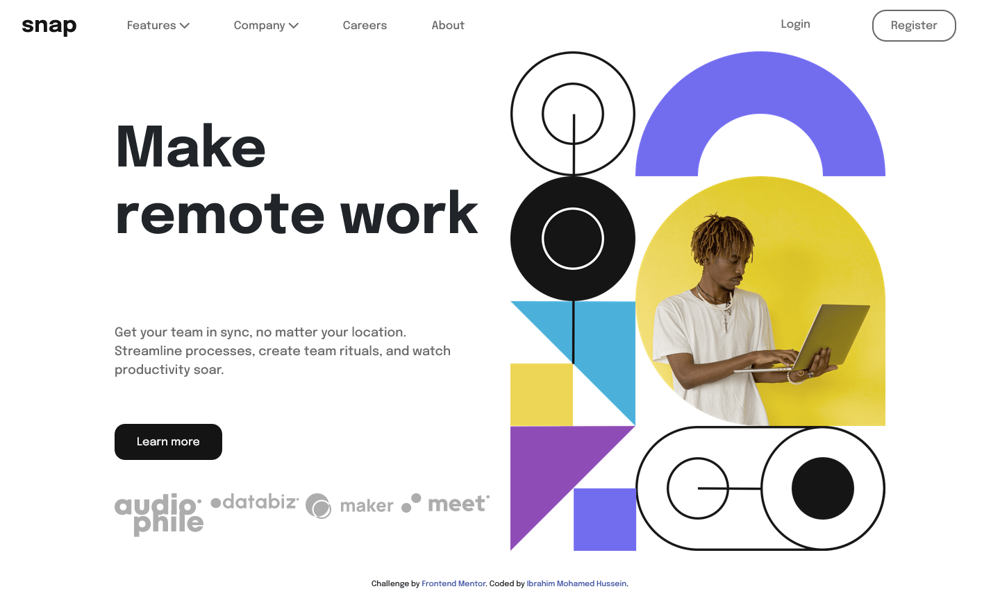

# Frontend Mentor - Intro section with dropdown navigation solution

This is a solution to the [Intro section with dropdown navigation challenge on Frontend Mentor](https://www.frontendmentor.io/challenges/intro-section-with-dropdown-navigation-ryaPetHE5). Frontend Mentor challenges help you improve your coding skills by building realistic projects.

## Table of contents

- [Overview](#overview)
  - [The challenge](#the-challenge)
  - [Screenshot](#screenshot)
  - [Links](#links)
- [My process](#my-process)
  - [Built with](#built-with)
  - [What I learned](#what-i-learned)
  - [Useful resources](#useful-resources)
- [Author](#author)

## Overview

### The challenge

Users should be able to:

- View the relevant dropdown menus on desktop and mobile when interacting with the navigation links
- View the optimal layout for the content depending on their device's screen size
- See hover states for all interactive elements on the page

### Screenshot

- Desktop view: 1440px



- Mobile view: 375px


### Links

- Solution URL: [FrontendMentor](https://www.frontendmentor.io/solutions/landing-page-t7K3t4SOZb)
- Live Site URL: [Landing page](https://ibrahim-mohamedh.github.io/landing-page/)

## My process

### Built with

- Semantic HTML5 markup
- CSS custom properties
- Bootstrap
- Jquery
- [WOW Animation](https://wowjs.uk/)
- [OWl carousel](https://owlcarousel2.github.io/OwlCarousel2/)

### What I learned

- How to detect window size and adjust element depending on specific size:

```js
$(window).resize(() => {
  if ($(window).width() > 992) {
    hero_img.attr("src", "./assets/images/image-hero-desktop.png");
  } else {
    hero_img.attr("src", "./assets/images/image-hero-mobile.png");
  }
});
```

### Useful resources

- [Stackoverflow](https://stackoverflow.com/questions/7789043/how-can-i-detect-window-size-with-jquery) - Helped me use Jquery to detect changes in window size.

## Author

- Website - [Ibrahim-MohamedH](https://github.com/Ibrahim-MohamedH)
- Frontend Mentor - [@Ibrahim-MohamedH](https://www.frontendmentor.io/profile/Ibrahim-MohamedH)
